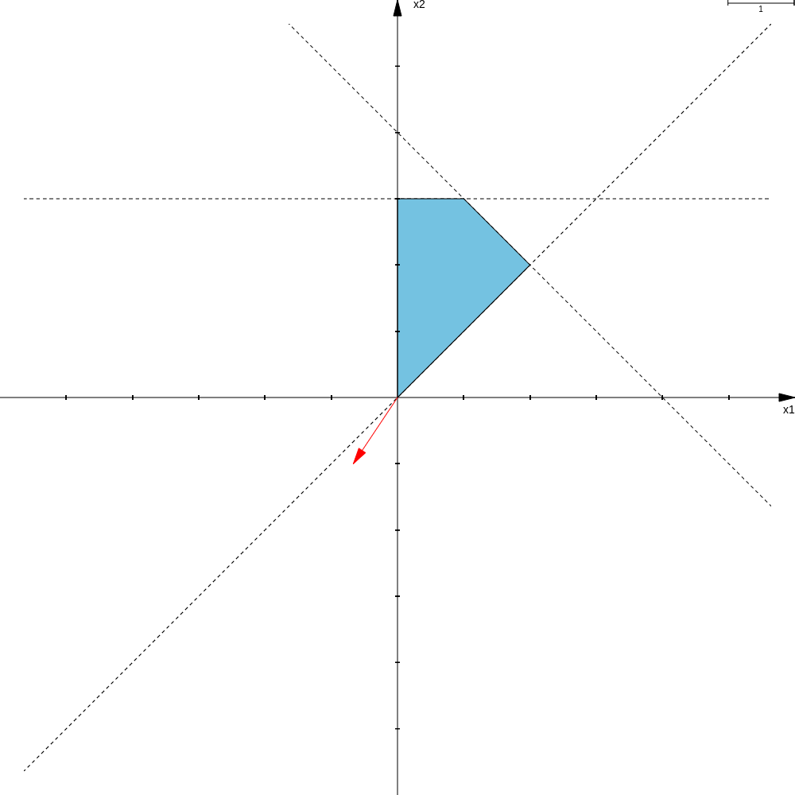

# Primal-Simplex-Algorithm
An algorithm to solve common Linear Programming problems in the form:


Where optimizing consists of **minimizing** or **maximizing**, and the real coefficients **c<sub>j</sub>**, **a<sub>ij</sub>** and **b<sub>i</sub>**, with **j = 1, 2, ..., n** and **i = 1, 2, ..., m**, are given in the problem. The decision-making variables of the problem are **x<sub>1</sub>, x<sub>2</sub>, ..., x<sub>n</sub>**.

## Usage

Consider the following problem:


With the viable region being represented by the blue area of the graph:



Extracting the data from the problem gives us:

### Running

Clone the repository, then run the algorithm and provide the data for the problem as input.

```shell
~/$ git clone https://github.com/tonisidneimc/Primal-Simplex-Algorithm
~/$ cd Primal-Simplex-Algorithm
~/$ python3 simplex.py
```


